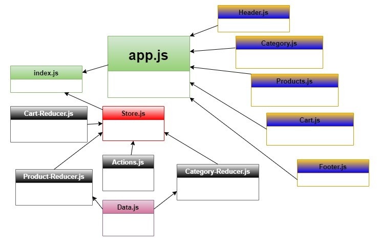

# LAB 36 - Application State with Redux

### Description :

#### 1. build react-redux app that has global state by redux.

#### 2. add static data of categories and products.

#### 3. allow user to see the products that are related to the selected category.

## PR link :

- [https://github.com/Ahmad-AbuOsbeh/storefront/pull/1](https://github.com/Ahmad-AbuOsbeh/storefront/pull/1)

## Deployed Link :

- [https://redux-ahmad-abuosbeh.netlify.app/](https://redux-ahmad-abuosbeh.netlify.app/)

## UML :

- 

   

# LAB 37 - Redux - Combined Reducers

### Description :

#### 1. add cart page.

#### 2. add to cart and delete features.

## PR link :

- [https://github.com/Ahmad-AbuOsbeh/storefront/pull/2](https://github.com/Ahmad-AbuOsbeh/storefront/pull/2)

## Deployed Link :

- [https://ahmad-abuosbeh-main-redux.netlify.app/](https://ahmad-abuosbeh-main-redux.netlify.app/)

## UML :

- 
